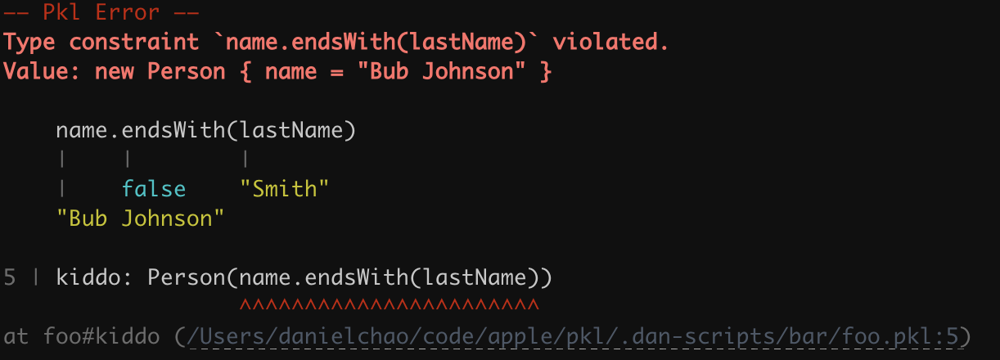

= Power assertions

* Proposal: link:./SPICE-0021-binary-renderer-and-parser.adoc[SPICE-0021]
* Author: https://github.com/bioball[Dan Chao]
* Status: Accepted or Rejected
* Implemented in: TBD
* Category: Language

== Introduction

We will enhance Pkl's error messages with power assertions.

Power assertions are error messages that display the values produced through executing source code in a visual diagram.

== Motivation

Pkl has some places that are assertions:

1. Type constraint expressions
2. The `facts` block of `pkl:test`

When these assertions fail, Pkl shows a limited amount of information about the failure.

For example, given the following program:

[source,pkl]
----
class Person {
  name: String
}

passenger: Person(name.endsWith(lastName))
  = new { name = "Bub Johnson" }

lastName: String = "Smith"
----

A failing typecheck simply tells that the type constraint check failed:

[source,text]
----
–– Pkl Error ––
Type constraint `name.endsWith(lastName)` violated.
Value: new Person { name = "Bub Johnson" }

5 | passenger: Person(name.endsWith(lastName))
----

This doesn't tell explain _why_ the type constraint failed.
For example, what is `lastName`?
What is the expectation?

== Proposed Solution

These assertions will be decorated with values produced by the AST nodes during execution.

With power assertions, the above error becomes:

[source,text]
----
–– Pkl Error ––
Type constraint `name.endsWith(lastName)` violated.
Value: new Person { name = "Bub Johnson" }

    name.endsWith(lastName)
    |    |        |
    |    false    "Smith"
    "Bub Johnson"

5 | passenger: Person(name.endsWith(lastName))
                      ^^^^^^^^^^^^^^^^^^^^^^^
----

== Detailed design

=== How the diagram works

The design of the diagram follows prior art:

* https://docs.groovy-lang.org/next/html/documentation/core-testing-guide.html#_power_assertions[Groovy]
* https://kotlinlang.org/docs/power-assert.html[Kotlin]
* https://github.com/kishikawakatsumi/swift-power-assert[swift-power-assert]
* https://github.com/power-assert-js/power-assert[power-assert-js]

The rules for displaying power asserts are:

Values are appended to the source graph using the `|` character.

[source,text]
----
 myName.startsWith(prefix)
 |      |          |
 "bub"  false      "g"
----

If two values cannot fit, the right-most value wins, and the left-most value gets moved down one line.

[source,text]
----
 num1 == num2
 |    |  |
 5    |  6
      false
----

Continually overlapping values will cascade.

[source,text]
----
 foo == bar
 |   |  |
 |   |  "barrey"
 |   false
 "foooey"
----

Literal values are omitted from the source.

[source,text]
----
 foo == "barrey"
 |   |
 |   false
 "foooey"
----

Literal values include stdlib types like IntSeq, List, Map whose members are also literal.
Here, `List(1, 2, 3)` is excluded because it's considered a literal:

[%nowrap]
[source,text]
----
–– Pkl Error ––
Type constraint `isInMyList` violated.
Value: "four"

    (it) -> myList.contains(it)
            |      |        |
            |      false    "four"
            List("one", "two", "three")

1 | foo: String(isInMyList) = "four"
----

Nodes from within things that can be executed multiple times are excluded.
These are:

  * Lambdas
  * For-generators
  * Member predicates

Here, the nodes within the lambda are not part of the diagram.

[%nowrap]
[source,text]
----
myList.fold(0, (a, b) -> a + b) == 5
|      |                        |
|      6                        false
List(1, 2, 3)
----

Expressions that span multiple lines have a blank line inserted in between.

[%nowrap]
[source,text]
----
 one
 |
 1

 + two
 | |
 | 2
 1.6666666666666665

 / three
 | |
 | 3
 0.6666666666666666

 == four
 |  |
 |  4
 false
----

=== Lambda constraints

Type constraints accept either a boolean, or a `Function1` lambda.

In the case of lambdas, the lambda's source section is diagrammed instead.

For example:

[%nowrap]
[source]
----
–– Pkl Error ––
Type constraint `isInMyList` violated.
Value: "four"

    (it) -> myList.contains(it)
            |      |        |
            |      false    "four"
            List("one", "two", "three")

1 | foo: String(isInMyList) = "four"
----

If the lambda recurses, only nodes that are executed once are shown in the diagram.

The following code:

[%nowrap]
[source,pkl]
----
foo: String(endsWithA) = "bar"

local endsWithA = (it) -> if (it.length == 1) it == "a" else endsWithA.apply(it.drop(1))
----

Throws this error:

[%nowrap]
[source]
----
–– Pkl Error ––
Type constraint `endsWithA` violated.
Value: "bar"

    (it) -> if (it.length == 1) it == "a" else endsWithA.apply(it.drop(1))
                                |  |
                                |  false
                                "r"

1 | foo: String(endsWithA) = "bar"
----

=== Colors

If colors are enabled, the source nodes are syntax highlighted, and the `|` character is emitted with ANSI code 2 (faint).

Sample:

=== Runtime implementation

Values are collected through truffle instrumentation, which is machinery to wrap AST nodes to observe their execution.

Instrumentation is disabled by default, and only enabled if an assertion fails.

Essentially, failing assertions are executed twice.
The algorithm works as follows:

1. Run the assertion; assertion fails
2. Enable instrumentation
3. Run the assertion again
4. Disable instrumentation

Running instrumentation has a runtime cost.
By only enabling instrumentation for failing assertions, we only pay this cost for the error path.

=== `test.catch`

Power assertions are hidden from the error passed to `test.catch` and `test.catchOrNull`; these two APIs work exactly like they do today.

=== Rendering values

Values are emitted with the single-line value renderer, with the max line length set to 80.

Values that are too long are truncated, just like they are today in constraint error messages.

=== Opting out of power assertions

Sometimes, power assertions may not be very informative.

For example, a list might be too long and simply introduce noise in the resulting error message.

User can use `throw()` within a failing constraint to provide their custom error message, rather than using power assertions.

== Compatibility

There is no impact on compatibility.
This design only impacts error messages, which is not considered an API.

== Future directions

=== Assertions as an API

Possibly, we can provide an in-language assertion API.
For example:

[source,pkl]
----
assert(1 == 2)
----

The assertion would also run display power assertions in the resulting thrown error.

This might play nicely with custom error messages:

[source,pkl]
----
local startingStartsWithBub = (it: String) ->
  assert(it.starsWith("bub"), "Foo should start with bub.")
----

=== Richer diagrams

We can possibly provide richer diagrams.
For example, in the case of failing string comparison, to display a unified diff.

[source]
----
–– Pkl Error ––
Type constraint `stringsAreEqual` violated.

    -expected +actual

    -foo
    +four

1 | foo: String(stringsAreEqual) = "four"
----

== Alternatives considered

N/A

== Acknowledgements

Power assertions was initially introduced in https://spockframework.org[Spock Framework] by Peter Niederwieser.
